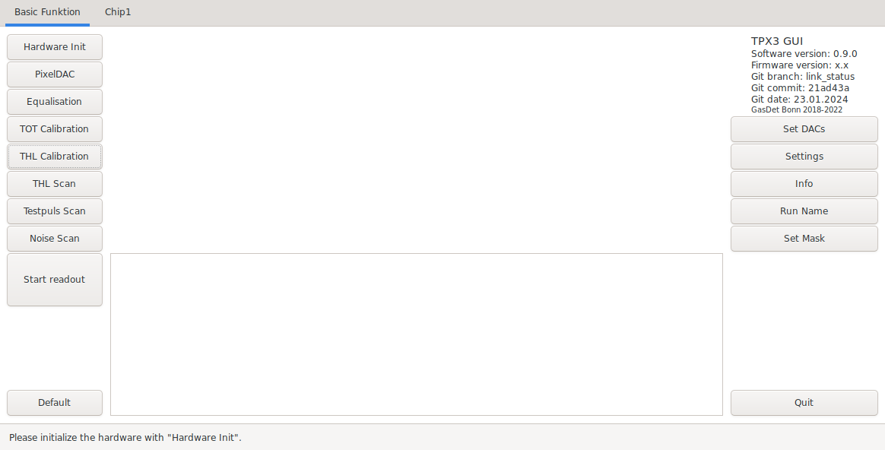
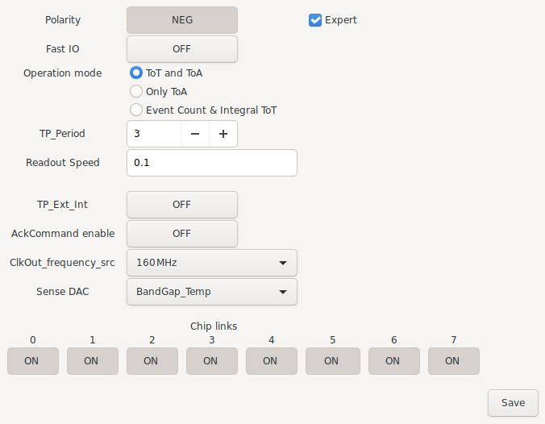
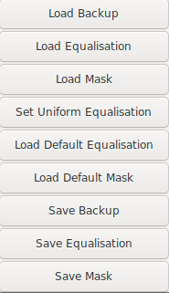
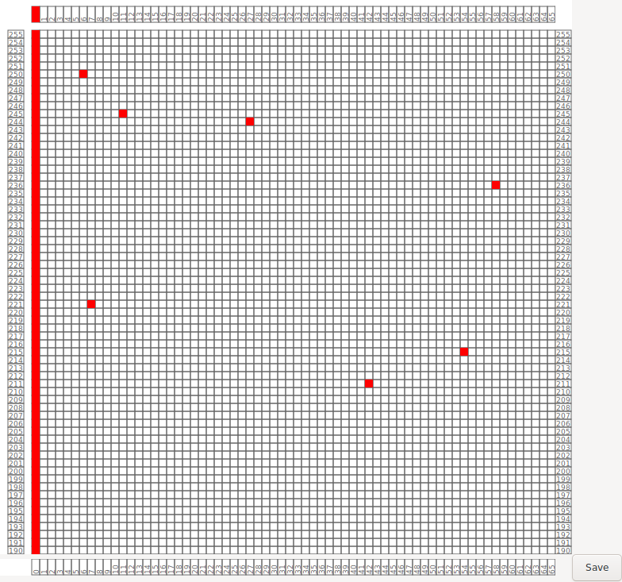
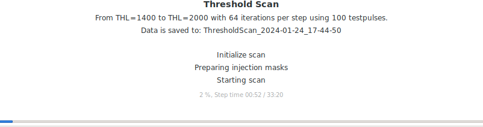

User Interfaces
===============
There are several user interfaces to support different applications. All
interfaces offer access to all needed functions to operate a Timepix3.
Additional functionality may differ between the interfaces.

Graphical User Interface (GUI)
------------------------------

There is a GTK3-based graphical user interface that offers all functionality
needed for operating Timepix3 chips. On the left side of the GUI you can find
all scans that are used to prepare a chip for operation and the readout itself.
On the right side you can find the relevant settings of the readout system and
the chip. With a click on the tab `Chip1` (the name changes to the ChipID of
the connected chip) you can see an event display for this chip. A click on
`Default` in the lower left of the GUI sets all settings back to default.

With a click on the `Settings` button a window opens for general settings of
the chip and the readout system. Within this window some additional settings
are accessible by checking the `expert` box. An overview of the available
settings is shown :ref:`here <generalsettings>`. At the lower end of the window
there are additional buttons to switch off individual data links of the chip.
After changes to the settings are done they should be saved by a click on the
`Save` button.

With a right click in the window additional settings are available to load
a full set of settings (DACs, mask, equalisation, general settings) with
`Load Backup`. Additionally masks and equalisation files can be loaded with
`Load Equalisation` and `Load Mask`. The backup, mask and equalisation can
be saved with the corresponding save buttons.

With a click on `Set Mask` it is possible to edit the current mask (deactivated
pixels). In this window masked pixels are shown in red. A click on a pixel
switches its status. It is also possible to click on the box for a column or a
row to switch the status of the full column or row. For better orientation in
the pixelmatrix one can use a right click to show the coordinate of the mouse
pointer. There is also the possibility to press the `ENTER` key to open a
text window. In this the status of a pixel, row or column can be changed by a
text input: 

.. table:: Mask commands
    :align: center

    ==========  =================
    Command     Function
    ==========  =================
    p <x> <y>   Mask pixel x,y
    up <x> <y>  Unmask pixel x,y
    c <x>       Mask column x
    uc <x>      Unmask column x
    r <y>       Mask row y
    ur <y>      Unmask row y
    a           Mask all pixels
    ua          Unmask all pixels
    ==========  =================

Each text input is applied via another press of the `ENTER` key. The new mask
matrix is saved with a press on the `Save` button.

If a scan is active the status of this scan is displayed in the middle of the
GUI main window. This status display usually contains the type of the scan, the
selected scan parameters, the filename the scan data is saved to, the current
step and a progress bar of the current step with the elapsed time and a time
estimate. For a readout without a defined end the progress bar is replaced with
a time counter.
During a scan the button `Quit` in the lower right of the GUI will change to
`Quit scan`. Pressing this button interrupts the current scan (data taken until
this point is still saved in the corresponding file of the scan) without closing
the GUI. Only a second press of this button closes the GUI completely.

Command Line Interface (CLI)
----------------------------
tdb

Application Programming Interface (API)
---------------------------------------
tdb